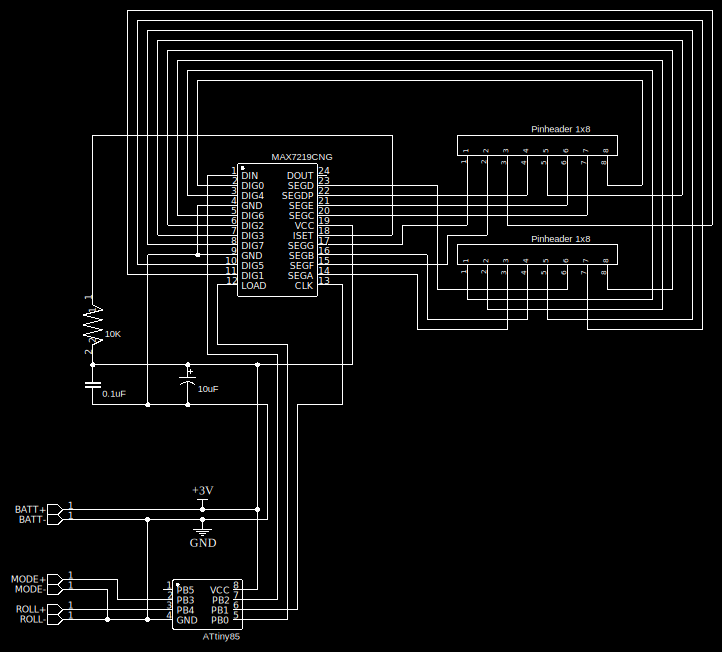
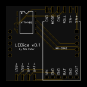
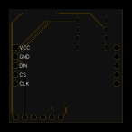

# LEDice

LEDice is a compact, battery-powered device that uses an ATTINY85 microcontroller and a MAX7219 8x8 LED matrix module to simulate dice rolls.

## Core Features

* Simulates dice roll with a press of a button
* Can display up to 4 dice at once
* Rechargable - USB-C port for charging
* Adjustable display brightness

## How it works

1. Power the device on using its power switch
2. Press the "Roll" button to roll the dice
3. Press the "Mode" button to increase the number of dice
   * Displaying more than one dice puts them in the corners at 3x3 pixels
   * Maximum number of dice is 4. After that it will change to one fullscreen dice again
4. Holding the buttons while powering on the device increases the brightness of the display as described in the table below. Note that a brightness value of 0 means that the display still visible, just at its dimmest setting.

| Roll pressed | Mode pressed | Brightness |
|--------------|--------------|------------|
| no           | no           | 0          |
| yes          | no           | 5          |
| no           | yes          | 10         |
| yes          | yes          | 15         |

## Hardware

The hardware folder contains the schematics and layout files for the custom PCB I used in this device. You can use these files to understand the hardware design or to create your own version of the device. I tried to make it easy for anyone to recreate this project.

* `schematic.svg` - The schematic diagram of the custom PCB. This can also be used as basis for trying out the project on a breadboard.

  
* `PCB-front.svg` - The PCB from the front.

  
* `PCB-back.svg` - The PCB from the back.

  
* [`gerber-LEDice-v0.1.zip`](https://github.com/tsomic/LEDice/blob/main/hardware/gerber-LEDice-v0.1.zip) - A Gerber file for PCB fabrication. You can upload it to companies like [PCBWay](https://www.pcbway.com/).

In the future, I'll also add files for a 3D printable case. The custom PCB is optional, but you'll probably need it if you want to use the case.

Components used (with product links):

These are the components used including their product links so you can make sure everything will fit into the case, if you decide to use the one provided:

* [ATTINY85 microcontroller including a socket](https://www.amazon.com/dp/B0BHZYGWSZ) - The socket allows you to easily remove the microcontroller from the PCB if needed.
* [MAX7219 square 8x8 LED matrix module](https://www.amazon.com/dp/B091GGNGWL) - make sure that the PCB of the matrix is square and not bigger than the matrix itself. Also there are options with different colors.
* [MH-CD42 LiPo Battery charging module](https://www.amazon.com/dp/B09XQB4J21)
* [LiPo Battery](https://www.ebay.com/itm/255510046348?var=555462939802) - make sure the dimensions are correct: 31mm x 24mm x 3mm
* [Female USB-C Port](https://www.amazon.com/dp/B091CRLJM2)
* [2 push buttons](https://www.ebay.com/itm/186063975695)
* [1 switch](https://www.ebay.com/itm/186063975344)

Please note, you'll need a programmer for the ATTINY85 microcontroller. The provided links are for reference, not necessarily the cheapest options. Feel free to shop around.

Soldering tip for the custom PCB: Plan your soldering order to avoid obstructing soldering spots.
