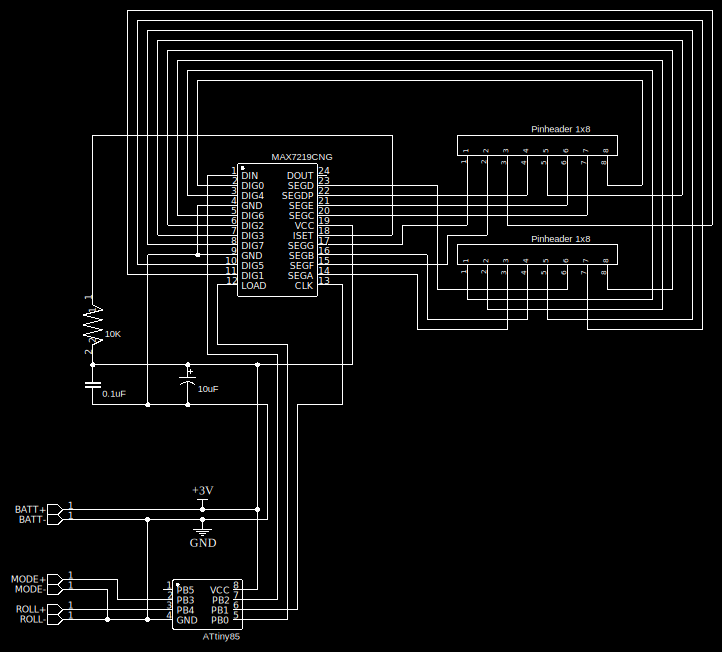
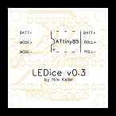
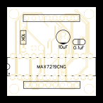
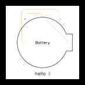
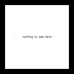

# LEDice

LEDice is a compact, battery-powered device that uses an ATtiny85 microcontroller and a MAX7219 8x8 LED matrix module to simulate dice rolls.

## Core Features

* Simulates dice roll with a press of a button
* Can display up to 4 dice at once
* Supports different kinds of dice: D4, D6, D8, D10, D12 and D20
* Adjustable display brightness

## Battery life

The runtime is around **45 hours** on the lowest brightness level, which is most commonly used.  
At maximum brightness, battery life can decrease to about 7 hours, but this can vary significantly depending on the selected dice.

## How it works

I made a flowchart to explain the features of the device.

On top of that, you can change the brightness of the dice by holding the buttons while switching it on:

| ROLL pressed | MODE pressed | Brightness |
|--------------|--------------|------------|
| no           | no           | darkest    |
| yes          | no           | dark       |
| no           | yes          | bright     |
| yes          | yes          | brightest  |

## Hardware

I designed two PCBs: The `Main PCB` and the `Battery PCB`.  
The contents of the main PCB can be viewed in the schematic below. The Pinheaders will be connected to the display and the Pins on the bottom left are soldering pads to connect the external buttons and the battery that is located on the other PCB.  
Don't forget to add the switch between one of the wires that connects the Baterry PCB to the Main PCB.

  
Below is the main PCB. There are boards available that already handle all the display wiring to make it easier to use with a microcontroller. I basically integrated the circuit of those modules into my PCB to save space inside the case.

 
  
The Battery PCB. It is a very simple PCB with the intention to make switching the battery easy.

 

You can use the gerber files [`gerber-LEDice-v0.3.zip`](https://github.com/tsomic/LEDice/blob/main/hardware/gerber-LEDice-v0.3.zip) [`gerber-Battery.zip`](https://github.com/tsomic/LEDice/blob/main/hardware/gerber-Battery.zip) for PCB fabrication. You can order them from companies like [PCBWay](https://www.pcbway.com/).  
The PCB dimensions are 32mm x 32mm with a thickness of 1mm.

In the future, I'll also add files for a 3D printable case. The custom PCBs are optional, but you will need them if you want to use the case.

### Components used

* ATtiny85 microcontroller including a socket
* Display control components (you can buy all these components together via [unsoldered DIY kits](https://fluxworkshop.com/products/ibaa100010-max7219-led-matrix-unsoldered?variant=32458809573436)).  
  * MAX7219CN
  * MAX7219 compatible 8x8 display
  * 10μF Capacitor
  * 0.1μF Ceramic Capacitor
  * 10KΩ Resistor
  * Two 8x1 Pin sockets for the display
* CR2032 Battery
* [Battery holder that fits the holes on the PCB](https://www.ebay.com/itm/255283139517)
* [2 push buttons](https://www.ebay.com/itm/186063975695)
* [1 small switch](https://www.ebay.com/itm/186063975344)

The provided links are for reference, not necessarily the cheapest or best options for you.  
Please note, you'll need a programmer for the ATtiny85 microcontroller.
